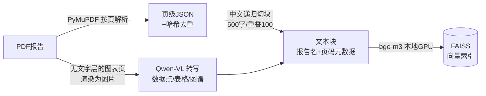
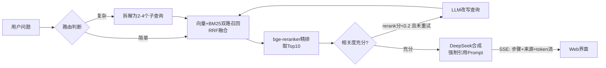

# 具身智能行业研究 RAG 问答系统

基于 120+ 份具身智能行业研究报告（券商深度、产业白皮书、智库报告）构建的检索增强生成（RAG）问答系统。提问行业问题，获得**带报告名+页码引用**的可溯源回答。

> "2025年具身智能市场规模预测是多少？" →
> *"根据摩根士丹利、高盛等机构预测，2025年全球具身智能规模达到192亿元人民币 [来源1]；亿欧智库预测中国市场规模为4,853亿元 [来源5]……"*
> 每条数据均可点开来源卡片核对报告原文。

## 功能特性

- **Agentic RAG**（LangGraph）：自动路由——简单问题直接检索，复杂问题（对比/综合/多主题）拆解为多个子查询分路召回再合并；检索相关度不足时自动改写查询重试；agent每步决策实时推送到前端
- **混合检索 + 精排**：向量（bge-m3）与 BM25（jieba）双路召回，RRF 融合，bge-reranker-v2-m3 交叉编码精排——专有名词、数字事实类查询显著提升（如"Unitree Dex5"从混入无关结果到 top3 全中 0.99 分）
- **图表多模态**：280个无文字层的扫描/图表页经 Qwen-VL 转写为结构化文本（图表数据点、表格、产业链图谱）入库，图表里的数字也能被检索问答，来源卡片带"图表页"标记
- **图注召回与裁剪**：扫全库 1960 张图的「图N: 标题」图注建语义索引，提问时按相关度召回最匹配的图，用 PyMuPDF 从 PDF 页**裁出图区插入回答**（如问"宇树发展历程"直接附上时间轴图）
- **来源可溯源**：回答中的每个论断标注 `[来源N]`，前端展示报告名、页码与可展开的原文片段；资料中没有的信息明确回答"未提及"，抑制幻觉
- **流式输出**：SSE 推送，先返回检索来源，再逐字输出回答
- **多源观点对比**：不同报告口径不一致时（如全球 vs 中国市场规模），分别列出并指明出处
- **增量入库**：新增 PDF 后重跑管道即可，内容哈希去重 + 断点续跑，已处理文档不重复解析/编码

## 架构

**离线管道**



**在线 Agent（LangGraph StateGraph）**



## 技术栈与选型理由

| 模块 | 选型 | 为什么 |
|---|---|---|
| PDF解析 | PyMuPDF | 按页提取保留页码元数据，引用可精确到页 |
| 图表解析 | Qwen-VL（百炼API） | 图表/文档理解第一梯队；OpenAI兼容接口，提示词约束输出数据点和表格转写 |
| 切块 | LangChain RecursiveCharacterTextSplitter | 中文标点分隔符优先级（段落>句>逗号），语义边界更完整 |
| Embedding | bge-m3（本地GPU） | 中文检索效果第一梯队，本地推理零API成本；归一化后内积=余弦相似度 |
| 向量库 | FAISS | 纯本地、性能稳定；代码内置 `VectorStore` 抽象层，可平滑替换 Milvus 等 |
| 关键词检索 | jieba + rank_bm25 | 弥补向量检索对专有名词/型号/缩写的弱势；RRF融合免去分数归一化 |
| 精排 | bge-reranker-v2-m3 | 交叉编码器逐对打分远准于双塔余弦；分数还复用为检索失败判据（触发查询改写） |
| Agent编排 | LangGraph | 条件边表达路由与自修正循环；`stream_mode=["updates","messages"]` 同时取节点事件和token流 |
| LLM | DeepSeek API | 中文生成质量好、成本低；Prompt 强制引用编号 + 禁止编造；JSON mode做路由/拆解的结构化输出 |
| 服务 | FastAPI + 原生JS单页 | SSE 流式接口，无前端框架依赖 |

**踩坑记录**（真实工程决策过程）：
- Chroma 1.x 的 Rust 内核在 Windows 上进程重启后重载 HNSW 索引报错，0.6.x 在 Python 3.13 无预编译 wheel——得益于向量库抽象层，半小时内切换到 FAISS，上层代码零改动
- FAISS C++ 层不支持中文路径，索引读写改用 `serialize_index` 经 Python 字节流中转
- PDF 文本含 U+2028 等 Unicode 行分隔符，JSONL 读取须用文件行迭代而非 `splitlines()`

## 快速开始

```bash
# 1. 安装依赖（Python 3.10+）
python -m venv .venv
.venv\Scripts\pip install -r requirements.txt
# NVIDIA显卡（驱动较旧只支持CUDA 11.x时）：
.venv\Scripts\pip install torch --index-url https://download.pytorch.org/whl/cu118 --force-reinstall --no-deps
# 无独立显卡：保持默认CPU版torch，并把 app/config.py 的 EMBEDDING_DEVICE 改为 "cpu"

# 2. 配置 DeepSeek API Key
copy .env.example .env   # 填入你的 key

# 3. 放入语料（PDF不随仓库分发）
# 将行业报告PDF放进 具身智能/ 目录

# 4. 构建索引（解析 → 切块 → 向量化入库，支持断点续跑）
.venv\Scripts\python app\ingest\parse_pdfs.py
.venv\Scripts\python app\ingest\parse_charts.py   # 可选：图表页VL转写（需.env配VL_API_KEY，百炼qwen-vl）
.venv\Scripts\python app\ingest\build_index.py
.venv\Scripts\python app\ingest\parse_figures.py   # 可选：抽取图注+图区bbox，启用"按问题召回图表并裁剪插入回答"

# 5. 启动服务（首次启动需约30秒加载embedding模型）
.venv\Scripts\python -m uvicorn app.api.main:app --port 8000
# 浏览器打开 http://localhost:8000
```

## 项目结构

```
app/
├── config.py            # 路径、模型、切块参数集中配置
├── ingest/
│   ├── parse_pdfs.py    # PDF→页级JSON：哈希去重、断点续跑、扫描页记录
│   ├── parse_charts.py  # 图表页→Qwen-VL转写为可检索文本，逐页断点续跑
│   ├── build_index.py   # 切块→bge-m3编码→FAISS入库（文本+图表统一索引）
│   └── parse_figures.py # 扫全库图注+图区bbox→figures.jsonl（按问题召回图表并裁剪）
├── rag/
│   ├── embedder.py      # bge-m3 封装（单例加载、批量编码）
│   ├── vectorstore.py   # VectorStore抽象层 + FAISS实现
│   ├── bm25.py          # jieba分词BM25索引（与FAISS同源语料，分词缓存）
│   ├── retriever.py     # 向量+BM25双路召回，RRF融合
│   ├── reranker.py      # bge-reranker-v2-m3 交叉编码精排
│   ├── qa.py            # 检索、上下文组装、引用Prompt（基线RAG，供对照评估）
│   ├── figures.py       # 图注向量召回（bge-m3 嵌入图注，按问题语义匹配相关图）
│   └── agent.py         # LangGraph agent：路由/拆解/混合检索/精排/改写重试/合成
└── api/main.py          # FastAPI：SSE流式 /ask（步骤+来源+图表+token）+ /page-image、/figure-image 渲染
web/index.html           # 聊天界面：流式渲染、来源徽章、相关图表区、图表裁剪展示
```

当前语料规模：120 份报告（去重后）→ 4,765 文本页 → 10,933 个向量块。

## 技术笔记

每个版本的设计动机、技术要点与踩坑记录：

- [v0.1 MVP：RAG基础链路](docs/v0.1-mvp-rag基础链路.md) — 按页溯源设计、中文切块、FAISS实战、防幻觉Prompt
- [v0.2 LangGraph Agentic RAG](docs/v0.2-langgraph-agentic-rag.md) — 图编排 vs 自由agent、条件边与自修正循环、双通道流式
- [v0.3 混合检索与Rerank精排](docs/v0.3-混合检索与rerank精排.md) — BM25互补性、RRF融合、交叉编码器原理、两阶段架构
- [v0.4 RAGAS评估体系](docs/v0.4-ragas评估体系.md) — 无参考指标、双环境解耦、LLM裁判的坑、诚实的trade-off分析
- [v0.5 图表多模态解析](docs/v0.5-图表多模态解析.md) — VL转写vs多模态检索的取舍、幂等管道、统一索引设计
- [v0.6 图注召回与裁剪](docs/v0.6-图注召回与裁剪.md) — 图注语义召回、连续带裁剪、按需渲染、与引用内联的互补

## 评估结果（v0.1基线 → v0.3完整链路）

| 指标 | 基线 | 完整链路 | Δ |
|---|---|---|---|
| AnswerRelevancy | 0.841 | 0.890 | +0.049 |
| ContextPrecision | 0.678 | 0.726 | +0.048（数字事实类 +0.255） |
| Faithfulness | 0.880 | 0.847 | -0.034（详见报告中的trade-off分析） |

完整分类别数据与归因分析见 [eval/results.md](eval/results.md)。

## Roadmap

- [x] **Agentic RAG**（LangGraph）：问题路由 + 拆解 + 多路检索 + 低分自动改写重试
- [x] **混合检索 + 重排**：BM25 + 向量双路召回 RRF 融合，bge-reranker-v2-m3 精排
- [x] **RAGAS 评估体系**：16题分类评估集，基线vs完整链路对照，DeepSeek裁判三指标（[报告](eval/results.md)）
- [x] **图表多模态解析**：280 个扫描/图表页经 Qwen-VL 转写入库（890块，零失败）
- [x] **图注召回与裁剪**：扫全库图注建索引（1960张图），按问题语义召回最相关的图并从 PDF 裁剪插入回答
- [ ] **Milvus 迁移**：基于现有 VectorStore 抽象层
